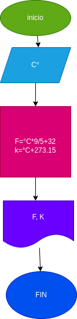

# Ejercicio No.1

## pasar de grados centigrados a grados fahrenheit y kelvin

# ANALISIS

variable de entrada (input)

C: Grados Centigrados

variables de proceso y salida (processing, storange, output)

F: Grados Fahrenheit
K: Grados Kelvin

# DISEÑO

# CONSTRUCCION